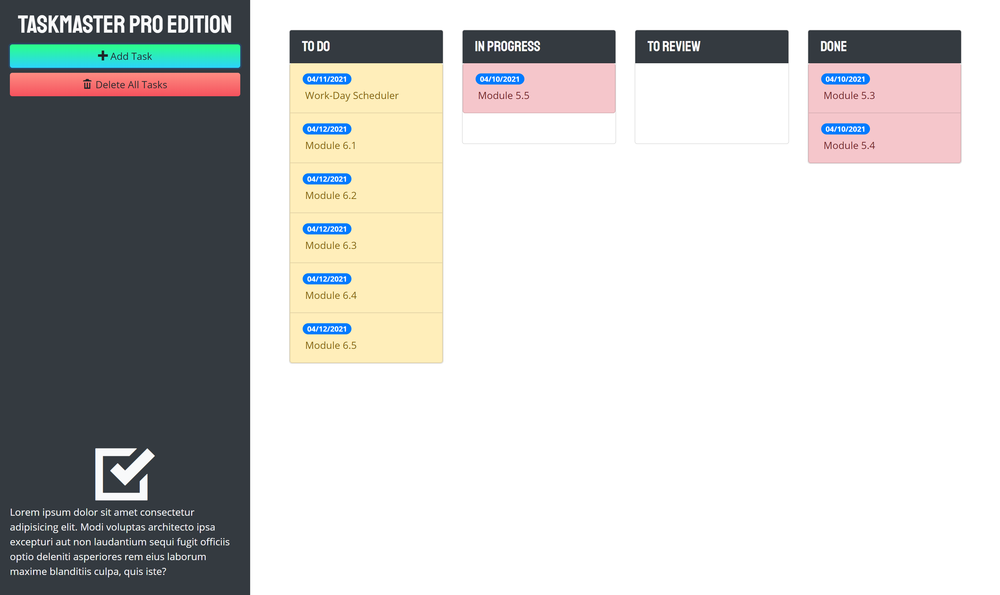

# Taskmaster Pro
Take control of your task list and their due dates with this graphically aiding application. Add a task and assign a due date. See when things are upcoming or overdue via color coordination. Easily manage if tasks are TO DO, In PROGRESS, IN REVIEW, or DONE. Delete a task by dragging it to the delete box or delete all tasks by selecting the delete all button.

## Description
* Click "Add Task" to see a modal that allows you to create a new task with a description and add it's due date.
* Modify a task by selecting the description or due date.
* Drag and drop the task to the appropriate status column.
* Visually see the due date of a task:
    * Yellow means the task is due in a few days.
    * Red means the task is overdue.
    * White tasks are more than a few days out.
    * _TO BE ADDED IN FUTURE UPDATE_ Green means it is done.
* When you drag a task, a delete box will appear for you to drag and drop to.
* Click "Delete All" to remove all tasks.

The tasks are saved via `localStorage`.

## ScreenShot

## Link
https://sirubu.github.io/taskmaster-pro/